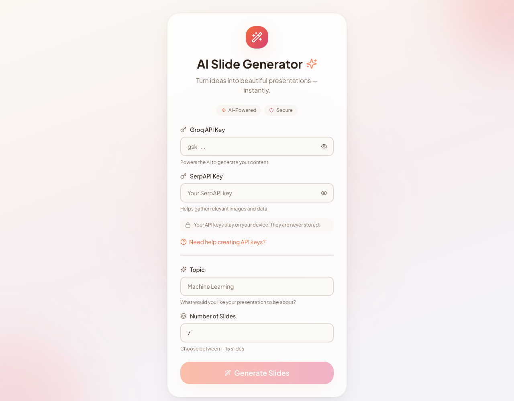

# 🪄 AI PPTX Presentation Generator

[](https://ai-slide-generator.onrender.com)
[](https://python.org)
[](https://groq.com)
[](LICENSE)

An intelligent, full-stack application that automatically generates complete, publication-ready PowerPoint (`.pptx`) presentations from a simple topic prompt. Powered by **Groq LLM (Llama 3.3 70B)** for structured slide generation, **SerpAPI / Unsplash** for contextual image extraction, and **python-pptx** for automated slide layout rendering.

---

## 📸 Interface Preview



---

## ✨ Features

- **🧠 Groq LLM Content Generation (`Llama-3.3-70B-Versatile`)**
  - Generates highly structured, professional, and concise slide titles and bullet points.
  - Ensures formal business tone without fluff or conversational filler.
- **🖼️ Contextual Image Fetching**
  - Primary search via **SerpAPI** (Google Images) for highly accurate image selection.
  - Smart fallback to **Unsplash** when primary image search is limited.
  - Automatic scaling, right-hand alignment, and strict boundary checks to avoid text overlap.
- **🎨 Automated Layout & Styling**
  - Custom base template support (`theme0.pptx`).
  - Formatted Title slide, main body slides, and automatic closing "Thank You" slide.
  - Intelligent title duplication removal and text box width management.
- **🌐 Dual Interface Support**
  - **Modern Web Interface**: Clean, glassmorphic UI built with React & Flask.
  - **Desktop GUI**: Quick offline utility built with Python Tkinter (`ui.py`).
  - **REST API**: Directly integrate presentation generation into external backend pipelines.

---

## 🛠️ Tech Stack

| Domain | Technologies |
| :--- | :--- |
| **Backend & Core Engine** | Python 3.9+, Flask, `python-pptx`, Flask-CORS |
| **AI Models & Crawlers** | Groq API (`llama-3.3-70b-versatile`), SerpAPI, Unsplash API, iCrawler |
| **Frontend** | React, Tailwind / Vanilla CSS, Glassmorphic UI Design |
| **Desktop App** | Python Tkinter |

---

## 📁 Repository Structure

```text
AI_PPTX_Generator/
├── apis/
│   ├── base_generation_api.py   # Abstract base class for generation APIs
│   └── groq_api.py               # Groq LLM integration & prompt structuring
├── crawlers/
│   ├── icrawlercrawler.py        # Local image scraper helper
│   └── serpapi_image.py          # Google Images crawler via SerpAPI
├── static_site/                  # Production build of the web frontend
├── generate_ppt.py              # Main core orchestration script
├── server.py                     # Flask Web Server & REST API endpoint
├── ui.py                         # Tkinter Desktop GUI
├── utils.py                      # Image processing & helper functions
├── theme0.pptx                   # Base presentation master template
├── preview.png                   # Web app preview screenshot
└── requirements.txt              # Python dependency manifest
```

---

## 🚀 Getting Started

### 1. Prerequisites

- Python 3.9 or higher
- [Groq API Key](https://console.groq.com) *(Free tier available)*
- *(Optional)* [SerpAPI Key](https://serpapi.com) for image search

### 2. Installation

Clone the repository and install the dependencies:

```bash
git clone https://github.com/samith-debug/AI_PPTX_Generator.git
cd AI_PPTX_Generator

# Install Python requirements
pip install -r requirements.txt
```

---

## 💻 Usage Options

### Option A: Running the Web App (Recommended)

Start the Flask server which serves both the frontend web app and API:

```bash
python server.py
```

Open your browser and navigate to: `http://localhost:5000`

### Option B: Running the Desktop App (Tkinter)

For a native desktop experience without web dependencies:

```bash
python ui.py
```

### Option C: Python Script / CLI

Generate presentations programmatically via Python:

```python
from generate_ppt import generate_ppt_api

file_path = generate_ppt_api(
    topic="Artificial Intelligence in Healthcare",
    api_name="groq",
    model_name="llama-3.3-70b-versatile",
    num_slides=7,
    api_key="YOUR_GROQ_API_KEY",
    serp_api_key="YOUR_SERP_API_KEY"  # Optional
)

print(f"Presentation saved to: {file_path}")
```

---

## 🔌 API Endpoint Reference

### `POST /api/generate`

Generates and downloads a `.pptx` presentation file.

#### Request Body (`JSON` or `Form Data`)

| Parameter | Type | Required | Description |
| :--- | :--- | :--- | :--- |
| `topic` | `string` | **Yes** | Subject/Topic of the presentation |
| `groq_api_key` | `string` | **Yes** | Your Groq API key |
| `serp_api_key` | `string` | No | Your SerpAPI key for Google Images |
| `slides` | `integer` | No | Number of slides (1 - 15, default: `7`) |

#### Response

- **Status 200**: Direct file download (`application/vnd.openxmlformats-officedocument.presentationml.presentation`)
- **Status 400/500**: `JSON` response containing `{"error": "Error description"}`

---

## 🤝 Contributing

Contributions, issues, and feature requests are welcome!  
Feel free to check out the [issues page](https://github.com/samith-debug/AI_PPTX_Generator/issues).

---

## 📜 License

This project is open-source under the [MIT License](LICENSE).
